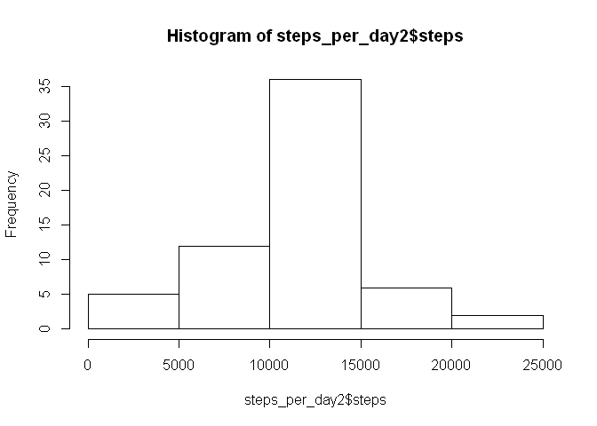

# Reproducible Research: Peer Assessment 1


## Loading and preprocessing the data


```r
  library(lattice)
  unzip(zipfile = "activity.zip")
  ds <- read.csv("activity.csv")
  ds$date <- as.Date(ds$date,"%Y-%m-%d")
  steps_per_day <- aggregate(steps ~ date, data = ds, sum ,na.rm = TRUE)
  steps_per_interval <- aggregate(steps ~ interval, data = ds, mean, na.rm = TRUE)
  missing <- !complete.cases(ds)
```


```r
  hist(steps_per_day$steps)
```

<!-- -->

## What is mean total number of steps taken per day?


```r
  summary(steps_per_day$steps)
```

```
##    Min. 1st Qu.  Median    Mean 3rd Qu.    Max. 
##      41    8841   10760   10770   13290   21190
```

## What is the average daily activity pattern?


```r
  plot(steps~interval,data=steps_per_interval,type="l")
```

<!-- -->

## Imputing missing values


```r
  sum(missing == TRUE)
```

```
## [1] 2304
```

```r
  ds2 <- ds[missing == TRUE,]
  ds2[,1] <- steps_per_interval$step
  ds_filled_na <- rbind(ds[complete.cases(ds),], ds2)
  steps_per_day2 <- aggregate(steps ~ date, data = ds_filled_na, sum)
  hist(steps_per_day2$steps)
```

<!-- -->

```r
  summary(steps_per_day2$steps)
```

```
##    Min. 1st Qu.  Median    Mean 3rd Qu.    Max. 
##      41    9819   10770   10770   12810   21190
```

## Are there differences in activity patterns between weekdays and weekends?


```r
  daynumber <- as.POSIXlt(ds_filled_na$date)$wday
  ds_filled_na$weekdays <- ifelse(daynumber %in% c(0,6), "Weekend", "Weekday")
  steps_per_week <- aggregate(ds_filled_na$steps, by=list(ds_filled_na$interval,ds_filled_na$weekdays),mean)
  names(steps_per_week) <- c("interval","weekdays","steps")
  xyplot(steps ~ interval | weekdays, steps_per_week, type="l",layout=c(1,2), xlab="Interval", ylab = "Number of steps", main="Activity Patterns on Weekends and Weekdays", col = "steelblue")
```

<!-- -->
